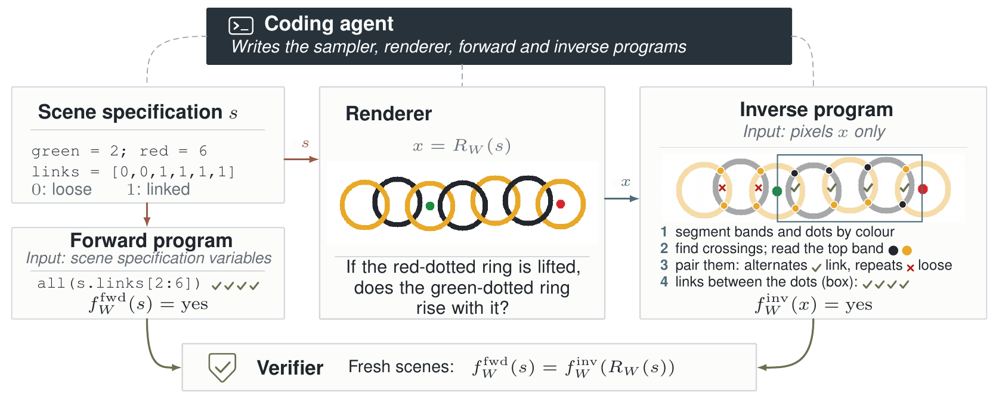

# PixelProof

[Project website](https://projectpixelproof.github.io/) · [Models and Datasets on Hugging Face](https://huggingface.co/collections/PixelProof/models-and-datasets-6ab5721714129252f17c21fd) · [Quick start](#run-your-first-example)

**Visual Question Generation through Forward–Inverse Agreement**

[](https://projectpixelproof.github.io/#teaser)

**[▶ Watch the teaser](https://projectpixelproof.github.io/#teaser)** · [Open the video directly](https://projectpixelproof.github.io/static/videos/pixelproof-teaser.mp4)

[Try the questions](https://projectpixelproof.github.io/questions.html) · [Explore the programs](https://projectpixelproof.github.io/programs.html) · [Spatial patterns](https://projectpixelproof.github.io/steering.html) · [Results](https://projectpixelproof.github.io/results.html)

PixelProof uses coding agents to generate visual questions and programs that verify their
answers. Each agent builds a **question world** (world): a visual question with a sampler, a
renderer, a forward program, and an inverse program. A world generates many
**instances**, each a scene specification, its rendered image, and the world's question.

Each instance is answered in two ways. A **forward program** computes the answer from
the scene specification used to draw the image. An **inverse program** solves the
question from the rendered pixels alone. The final checks require these answers to agree
on 72 scenes. This catches worlds whose answers exist in the scene specification
but cannot be recovered from the image by the inverse program.



This repository runs the paper's three generation experiments. It includes the
coding-agent interfaces, controller, verifier, starting inputs, and example commands.
The paper also studies downstream fine-tuning; that training pipeline is **not included
in this release**.

Agreement on the tested scenes does not establish that a question is clear to humans,
novel, or difficult for vision–language models.

## How the generation loop works

1. The **controller** starts an episode with instructions, reference code, and the
   campaign's current accepted worlds and most recent failure report.
2. A fresh **coding agent** develops one world. It can render examples, run
   self-checks, and repair its code before submitting.
3. After submission, the agent environment is replaced with a clean offline
   container. The **verifier** then runs the final checks, including
   forward–inverse agreement on 72 scenes from three fixed seeds.
4. The controller records the outcome, applies retention criteria, and prepares
   the next episode. Only the saved campaign records carry over; each agent
   starts a new conversation.

A **campaign** is a sequence of these episodes with the same coding-agent configuration
and generation instructions.
Spatially-steered and model-feedback-steered generation add guidance to later episodes
while keeping the final checks fixed. See the paper's **§3, Method**, especially
§3.2 for the generation loop.

## Experiments in the paper

The table links each experiment to its section of the paper and its run instructions in
this repository. Section numbers refer to the manuscript. Directory names and the
`--rq` option of the release commands keep the original experiment numbering.

| Paper experiment | What you run | Paper section | Worked example |
| --- | --- | --- | --- |
| **Profile-steered generation** | Invent worlds under one of nine discovery profiles | §4.1 | [`examples/rq1`](examples/rq1/README.md) (`--rq 1`) |
| **Spatially-steered generation** | Also request a spatial pattern for where the answer's evidence lies in the image | §4.2 | [`examples/rq2`](examples/rq2/README.md) (`--rq 2`) |
| **Model-feedback-steered generation** | Start from ten existing worlds and use frontier-model errors to guide later generation | §4.5 | [`examples/rq3`](examples/rq3/README.md) (`--rq 3`) |
| **Training on generated questions** | Fine-tune open-weight models on generated examples | §4.7 | [Release scope](examples/rq4/README.md): training is not packaged |

The release provides one preset each for **Codex, Claude Code, and OpenCode through
OpenRouter**. The paper evaluates five model/reasoning configurations across these three
agent tools; this release includes three example presets. Historical campaigns, result
tables, and the separate 200-scene replay analysis are not included.

## What the agent starts with

All three generation experiments receive source snapshots of **two-circle contact, angle
acuteness, and counting with distractors**. These teach the interfaces for rendering,
questions, answers computed from scene data, and solving from pixels alone. Runnable
versions are included under `worlds/`; [render them
locally](examples/shared_examples/README.md).

**Profile-steered and spatially-steered generation** also receive one fixed discovery
profile with five text-only example questions, construction requirements, and rules
against superficial copies of existing worlds. All five examples appear together in
every episode and guide the agent in designing a new world. The nine discovery profiles
are:

| Profile | Intended visual computation |
| --- | --- |
| Tracing | Follow paths, curves, or networks |
| Topology | Recover connectivity, holes, or enclosure |
| Correspondence | Match parts or relations across panels |
| Search | Find the item satisfying visible constraints |
| State tracking | Track identities or states through updates |
| Measurement | Read and compare quantities |
| Prior conflict | Report visible evidence despite familiar expectations |
| Global structure | Combine distributed evidence or negative space |
| Declared transform | Apply an explicitly stated rearrangement |

For example, the Tracing profile includes **“Which terminal is farthest from green along
the lines?”** and tells the agent to reconstruct a graph or centerline from pixels.
Profile-specific implementations, images, and answers are not supplied. Read the [exact
profiles](foundry/discovery_profiles/paper-semantic/v0.3/) and the [input
guide](docs/INPUTS.md). The paper's appendix lists the profiles and their example
questions.

**Model-feedback-steered generation** uses feedback example set A or B, each with ten
world implementations and tests, a card describing the starting worlds and difficulty
objective, and fixed evaluator summaries. It does not use the nine discovery profiles.
Starting-feedback JSON includes recorded answers, model predictions, and whether each
prediction is correct; these are not reference answers for a new submission. Initial
image files are absent, but supplied code can render images and later submission bundles
can contain galleries. See [its inputs](experiments/rq3/README.md).

## Run your first example

### 1. Install and check the environment

Use Python 3.12, Git, [uv](https://docs.astral.sh/uv/), and Docker with Compose. Linux,
macOS with Docker Desktop, or Linux in Windows WSL2 can run the container workflow. No
local GPU is required. Start Docker, then run from the repository root:

```bash
uv sync --locked --extra runner --group dev
bash harbor/build_latex_tikz_runtime.sh
uv run --extra runner python -m scripts.doctor
uv run --extra runner python -m scripts.docker_smoke
```

The smoke test uses a fixed example to check container replacement and final
verification. **It makes no model calls and needs no credentials.** It downloads
dependencies and writes diagnostics under `artifacts/docker-smoke/`. For another smoke
run, add `--out artifacts/docker-smoke-002`. See [setup](docs/SETUP.md) for resource
requirements and troubleshooting. Add `--rq 2` or `--rq 3` and a new `--out` path to
check either of the other generation experiments without calling a model.

If using a source ZIP, initialize Git before preparing campaigns. The runner records the
source commit and requires a clean working tree:

```bash
git init -b main
git config user.name "PixelProof authors"
git config user.email "anonymous@example.invalid"
git add .
git commit -m "Import PixelProof release"
```

### 2. Prepare a campaign and inspect what the agent will see

```bash
bash examples/rq1/prepare.sh --agent codex --profile tracing --id rq1_tracing_demo
uv run --extra runner python -m scripts.release preview \
  --campaign campaigns/rq1_tracing_demo.toml --out artifacts/rq1-preview
```

These commands create a campaign configuration and the files for its first episode
without contacting a model. The preview prints the task directory: open `instruction.md`
and `environment/starter/` there to read the actual agent inputs.

The default campaign budget is **20 minutes of agent-session time**. For the paper's
six-hour budget, add `--agent-seconds 21600` when preparing; episodes remain capped at
20 minutes. These budgets exclude final verification and later analysis. Use a new
campaign ID and output directory for every run.

### 3. Authenticate, freeze, and run

Follow the [authentication guide](docs/AUTHENTICATION.md) for your chosen agent tool. It
covers host CLI installation, credential forwarding, a small **paid** authentication
test, and the required provider confirmation variables. Model-feedback-steered
generation also needs an OpenRouter evaluator key, regardless of which coding agent you
use.

After inspecting the configuration and completing authentication, freeze the
configuration to mark it ready for execution. Commit it to record the run settings:

```bash
uv run --extra runner python -m scripts.release freeze \
  --campaign campaigns/rq1_tracing_demo.toml
git add campaigns/rq1_tracing_demo.toml
git commit -m "Freeze profile-steered tracing campaign"
bash examples/run_campaign.sh rq1_tracing_demo
```

The final command **starts a paid campaign**. Your account must have access to the
configured model; installing its command-line tool does not establish that access. [All
example walkthroughs](examples/README.md) cover the corresponding steps for the other
two experiments.

## What a run saves

A campaign writes its state, per-episode agent inputs, submitted worlds, final
verification reports, and evaluator feedback under `artifacts/<campaign-id>/`.
Spatially-steered campaigns also keep a record of measured spatial patterns. These local
outputs are ignored by Git and are not included in the source-release ZIP.

To stop after the current episode completes verification:

```bash
touch artifacts/rq1_tracing_demo/STOP_AFTER_CURRENT_EPISODE
```

The runner does **not** resume an interrupted campaign in place. The release includes
world rendering and inverse verification, but has no general command for replaying or
backing up a saved campaign. In particular, the feedback-example-set smoke check is not
the paper's separate 200-scene replay evaluation.

## Code and further reading

| Location | Contents |
| --- | --- |
| [examples/](examples/README.md) | Step-by-step scripts and walkthroughs for the paper experiments |
| `src/question_foundry/`, `scripts/run_sequential_campaign.py` | Controller state, episode construction, guidance, and execution |
| `harbor/` | Coding-agent adapters, Docker images, self-check and final-verification integration |
| `foundry/`, `configs/agents/`, `experiments/` | Versioned instructions, profiles, policies, and campaign configurations |
| `worlds/`, `inputs/starting_collections/` | Three runnable implementation demonstrations and two ten-world feedback example sets |
| [docs/INPUTS.md](docs/INPUTS.md) | Input files and what agents can read |
| [docs/RELEASE_NOTES.md](docs/RELEASE_NOTES.md) | Differences from historical campaigns and known differences between the frozen prompts and the paper |
| [docs/VALIDATION.md](docs/VALIDATION.md) | How to run the checks, and what is not yet tested |

Run the local test suite with `uv run --extra runner pytest -q`. Manuscript sources,
historical agent traces, and credentials are excluded.

Licensed under [CC BY-NC 4.0](LICENSE). Attribution: **PixelProof authors** (anonymous
release). Dependencies retain their own licenses.
